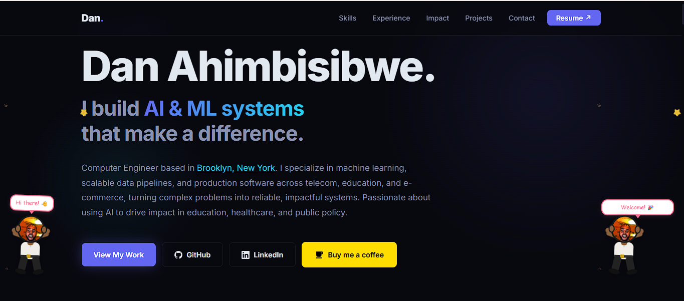
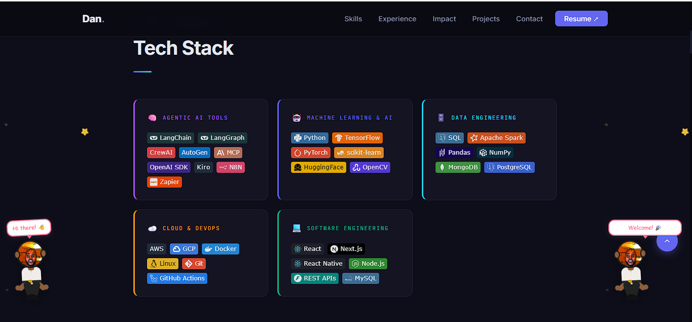
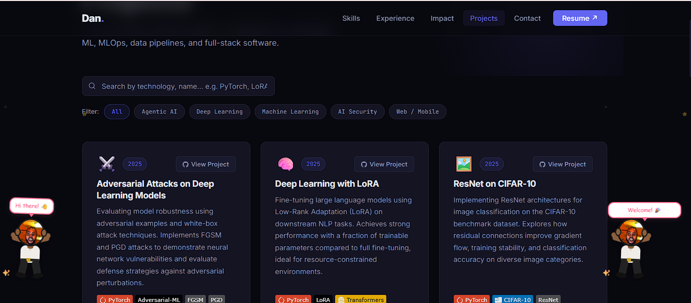

# Heartfolio - Portfolio Website Template

A clean, dark-themed personal portfolio for GitHub Pages. No frameworks, no build tools - just HTML, CSS, and a little JavaScript.

**[Live demo](https://dahimbis.github.io/)** - **[Author](https://github.com/dahimbis)**

> Made by [Dan Ahimbisibwe](https://dahimbis.github.io/) - feel free to use and customise it.

---

## Preview





---

## What is included

```
heartfolio/
├── index.html          # Homepage (hero, skills, experience, projects, contact)
├── projects/
│   └── index.html      # Full projects page with search and filter
├── 404.html            # Custom 404 page
├── sitemap.xml         # For search engines
├── robots.txt          # For search engine crawlers
├── meta/
│   └── site.webmanifest  # PWA manifest (makes the site installable)
└── .gitignore
```

---

## Quick start

### 1. Copy the template

**Option A - Use this as a GitHub template:**
Click "Use this template" at the top of this repo, name it `YOUR-USERNAME.github.io`, and clone it.

**Option B - Clone manually:**
```bash
git clone https://github.com/dahimbis/heartfolio-website-template.git YOUR-USERNAME.github.io
cd YOUR-USERNAME.github.io
git remote set-url origin https://github.com/YOUR-USERNAME/YOUR-USERNAME.github.io.git
```

### 2. Enable GitHub Pages

1. Push the repo to GitHub (repo name must be `YOUR-USERNAME.github.io`).
2. Go to **Settings - Pages**.
3. Under Source, select **Deploy from a branch** - **main** - **/ (root)**.
4. Your site will be live at `https://YOUR-USERNAME.github.io` within a minute.

---

## How to customise

Every placeholder is marked in UPPERCASE. Search for them and replace with your real information.

| Placeholder | Replace with |
|---|---|
| `YOUR NAME` | Your full name |
| `YOUR ROLE` | Your job title or description (e.g. "Software Engineer") |
| `YOUR CITY` | Where you are based |
| `YOUR-USERNAME` | Your GitHub username |
| `YOUR-LINKEDIN-HANDLE` | Your LinkedIn profile handle |
| `YOUR_TWITTER_HANDLE` | Your Twitter/X handle (or remove the tag) |
| `YOUR-EMAIL@example.com` | Your email address |
| `YOUR TAGLINE HERE` | A short phrase shown above the hero heading |

---

## Sections guide

### Hero
Edit `index.html` around the `<section id="hero">` block.
Change the heading, tagline, and CTA button links.

### Skills
Each skill card lives inside `.skills-grid`.
Copy and paste a `.skill-card` block to add a new category.

**Adding badge images:**
Badges use [shields.io](https://shields.io). The format is:
```
https://img.shields.io/badge/LABEL-COLOR?style=flat-square&logo=LOGO&logoColor=white
```
Find logo names at [simpleicons.org](https://simpleicons.org).

Example - a Python badge:
```html

```

### Experience
Edit the `.timeline` section. Each job is a `.timeline-item`. Copy one to add more entries.

### Projects (homepage cards)
Edit the `.projects-grid` in `index.html`. Each project is a `.project-card`.

### Projects page (`projects/index.html`)
Each card needs two data attributes:
- `data-name` - lowercase keywords for the search box
- `data-category` - must match one of the filter button `data-filter` values

To add a new filter category, add a button:
```html
<button class="filter-btn" data-filter="my-category">My Category</button>
```
Then use `data-category="my-category"` on the relevant cards.

### Contact form
The form uses [FormSubmit](https://formsubmit.co) - free, no account required, no backend.

1. Replace `YOUR-EMAIL@example.com` in the form action with your real email.
2. Replace `YOUR-USERNAME` in the `_next` hidden field with your GitHub username.
3. Submit the form once - FormSubmit will send you a one-time activation email.

After activation, all form submissions go straight to your inbox.

---

## Colours and fonts

All colours are CSS variables in `:root` at the top of each HTML file:

```css
:root {
  --bg:      #08080f;   /* page background */
  --surface: #0d0d1a;   /* card background */
  --accent:  #6366f1;   /* indigo - primary accent */
  --cyan:    #22d3ee;   /* cyan - secondary accent */
  --text:    #e2e8f0;
  --muted:   #8892b0;
}
```

Change these values to completely retheme the site.

Fonts are loaded from Google Fonts:
- **Inter** - body text
- **JetBrains Mono** - labels and code elements

---

## Favicon

Put your favicon files in the `meta/` folder. You can generate them for free at [favicon.io](https://favicon.io).

Files needed:
- `meta/favicon-32x32.png`
- `meta/apple-touch-icon.png` (180x180)
- `meta/android-chrome-192x192.png`
- `meta/android-chrome-512x512.png`
- `meta/social-preview.png` (1200x630, used for link previews on social media)

---

## Google Analytics (optional)

1. Go to [analytics.google.com](https://analytics.google.com) and create a property.
2. Copy your Measurement ID (looks like `G-XXXXXXXXXX`).
3. In each HTML file, find the commented-out Analytics block and uncomment it, replacing `G-XXXXXXXXXX` with your ID.

---

## Sitemap and robots.txt

Open `sitemap.xml` and `robots.txt` and replace `YOUR-USERNAME` with your GitHub username.
These files help search engines index your site correctly.

---

## Adding more pages

To add a new page (e.g. a blog or an about page):

1. Create a new folder: `about/`
2. Add `about/index.html` - copy the structure from `projects/index.html` as a starting point.
3. Add it to the nav in every page.
4. Add it to `sitemap.xml`.

---

## License

This template is free to use and modify. Attribution is appreciated but not required.

If you find it useful, consider starring the repo!
